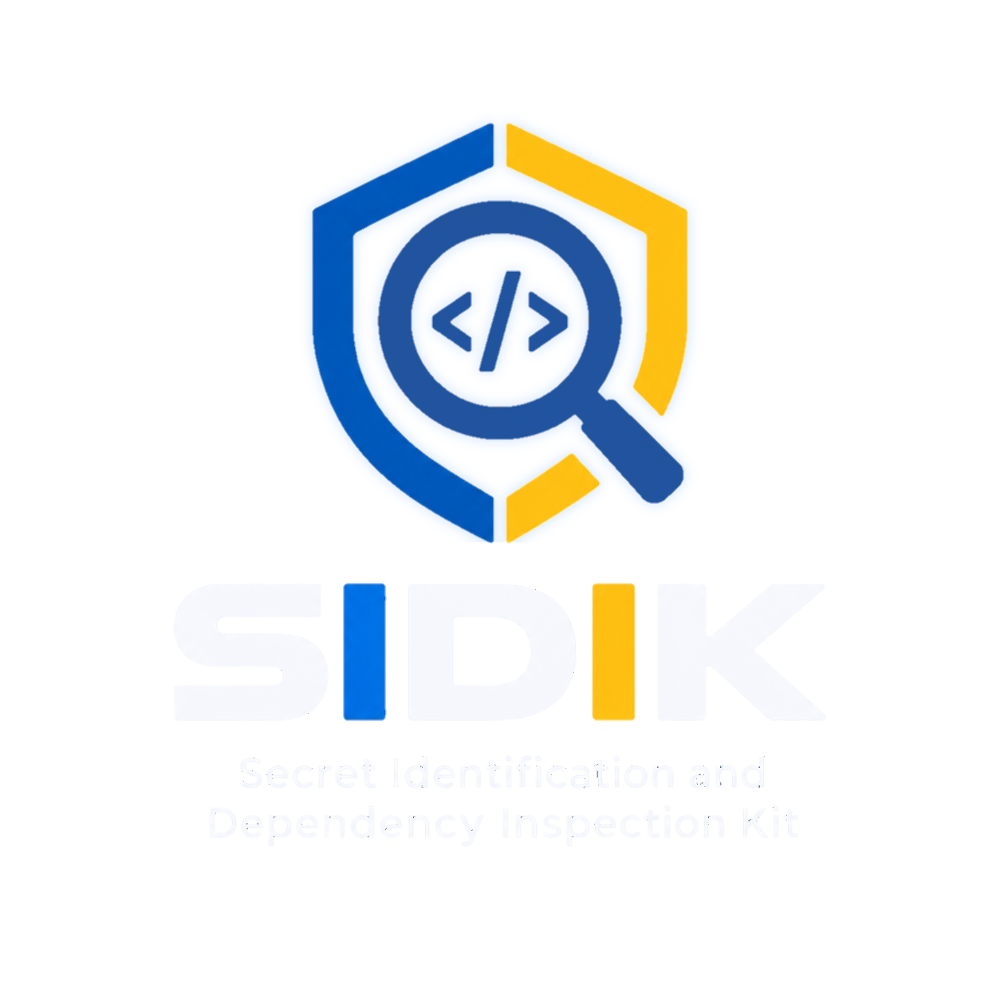

<div align="center">

<picture>
  <source media="(prefers-color-scheme: dark)" srcset="logo/SIDIK-nobg-dark.png">
  <source media="(prefers-color-scheme: light)" srcset="logo/SIDIK-nobg.png">
  
</picture>

# SIDIK
### Secret Identification and Dependency Inspection Kit

**Lightweight Static Application Security Testing (SAST) & Software Composition Analysis (SCA) for Python**

[](https://www.python.org/)
[](LICENSE)
[]()
[]()
[]()
[]()
[]()

---

### 🌐 Language / Bahasa
**[🇮🇩 Baca dalam Bahasa Indonesia](#-bahasa-indonesia)** &nbsp;&nbsp;•&nbsp;&nbsp; **[🇬🇧 Read in English](#-english)**

---

</div>

<br/>

---

# 🇮🇩 Bahasa Indonesia

## 📌 Ikhtisar Proyek

**SIDIK** (*Secret Identification and Dependency Inspection Kit*) adalah instrumen analisis keamanan statis (*Static Application Security Testing* / SAST) dan analisis komposisi perangkat lunak (*Software Composition Analysis* / SCA) terpadu berbasis Python. 

Dengan menggabungkan analisis konteks leksikal, entropi Shannon, dan basis data kerentanan advisori luring untuk 5 format manifest, **SIDIK** dirancang untuk mendeteksi *hardcoded secrets* dan dependensi rentan secara akurat dengan tingkat alarm palsu (*False Positive Rate* / FPR) yang ditekan hingga **0%** serta *overhead* waktu eksekusi agregat kurang dari **50 milidetik**.

Instrumen ini kini dilengkapi dengan **rekomendasi perbaikan praktis (*actionable remediation guidance*)** untuk setiap temuan serta antarmuka **dwi-bahasa dinamis (Bahasa Indonesia & English)** yang dapat dialihkan secara langsung (*instant toggle*) tanpa memuat ulang aplikasi.

---

## ✨ Fitur-Fitur Utama

1. **Deteksi Rahasia Cerdas (*Intelligent Secret Detection*):**
   - Mendeteksi 12 jenis kredensial sensitif (*AWS Access Keys, Google Cloud API Keys, OpenAI API Keys, Stripe Keys, GitHub PAT, Slack Tokens, JWT, Private Keys, Password Plaintext, Connection Strings*).
   - Menggunakan kombinasi pola *regular expression*, analisis entropi informasi Shannon, dan penyaringan konteks leksikal berbasis AST/token untuk mengeliminasi alarm palsu (*benign placeholders*, *dummy variables*).
2. **Analisis Komposisi Perangkat Lunak Luring (*Offline SCA*):**
   - Mendukung 5 format manifest dependensi Python: `requirements.txt`, `pyproject.toml` (PEP 621 & Poetry), `Pipfile`, `poetry.lock`, dan `setup.py`.
   - Pencocokan kerentanan luring berbasis basis data advisori CVE lokal tanpa ketergantungan jaringan internet saat pemindaian.
3. **Detail Temuan & Rekomendasi Perbaikan (*Remediation Guidance*):**
   - Setiap temuan dilengkapi dengan langkah mitigasi operasional yang jelas, seperti rotasi kunci API, pencabutan token, isolasi ke variabel lingkungan (*environment variables*), atau perintah pembaruan versi paket (`pip install --upgrade ...`).
4. **Dukungan Dwi-Bahasa Dinamis (*Bilingual Support* ID ↔ EN):**
   - **Desktop GUI:** Tersedia tombol alih bahasa langsung (`🌐 English (EN)` / `🌐 Indonesia (ID)`) di pojok kanan atas yang langsung memperbarui seluruh teks antarmuka, metrik, tabel, status, dan rekomendasi perbaikan secara instan.
   - **CLI Scanner:** Tersedia flag `--lang {id,en}` untuk menghasilkan ringkasan konsol atau laporan Markdown dalam bahasa yang diinginkan.
5. **Desktop GUI Modern, Glassmorphic, & Ringan:**
   - **Zero-Dependency Glassmorphism:** Menghadirkan efek Windows 11 Acrylic/Mica backdrop, bilah judul gelap (*dark title bar*), dan sudut membulat (*rounded corners*) asli OS via modul standar `ctypes` tanpa library eksternal.
   - **Pencarian Cepat (*Live Search*) & Filter Multi-Dimensi:** Kolom pencarian kata kunci instan (<1ms) serta filter berdasarkan tingkat bahaya (*Critical, High, Medium, Low*) dan tipe temuan (*Secrets* vs *Dependencies*).
   - **Kartu Metrik Interaktif:** Kartu metrik tingkat bahaya dapat diklik langsung untuk memfilter tabel temuan.
   - **Aksi Salin Satu-Klik (*Quick Copy*):** Tombol praktis untuk langsung menyalin rekomendasi remediasi dan potongan kode ke clipboard sistem.
   - **Ekspor Laporan Multi-Format:** Mendukung ekspor ke format Markdown (`.md`), JSON (`.json`), dan Spreadsheet CSV (`.csv`).
   - **Startup Instan & Hemat Memori:** 100% pustaka standar Python (`tkinter`/`ttk`), konsumsi RAM hanya ~20 MB dengan peluncuran seketika (<0.2s).
6. **CLI Modern Sarat Informasi (*Information-Dense ANSI Output*):**
   - Tampilan terminal berbingkai rapi, pita distribusi tingkat bahaya berwarna, blok rekomendasi terstruktur, dan dukungan opsi `--format csv` serta `--no-color`.
7. **Bebas Kebocoran Data Evaluasi (*Zero Data Leakage*):**
   - Dataset pemodelan dipisahkan secara ketat (*train/development, validation, test/benchmark*) dengan label *ground truth* teranotasi manual untuk validitas riset akademis.

---

## 📁 Struktur Direktori Repositori

```
SIDIK/
├── logo/                     # Identitas Visual & Ikon Aplikasi SIDIK
│   ├── SIDIK-nobg-dark.png   # Logo transparan adaptif tema gelap (kontras tinggi)
│   ├── SIDIK-nobg.png        # Logo transparan dengan tipografi (latar terang)
│   ├── SIDIK-nobg-purelogo-dark.png # Lambang perisai adaptif tema gelap (glow rim)
│   ├── SIDIK-nobg-purelogo.png # Lambang perisai transparan murni
│   ├── SIDIK-bg.png          # Logo dengan latar belakang putih solid
│   ├── SIDIK-purelogo.png    # Lambang perisai resolusi ultra-tinggi (3264x3264)
│   └── sidik_icon.ico        # Ikon aplikasi Windows multi-resolusi (16x16 - 256x256)
│
├── sidik/                    # Core Engine & Modul Paket SIDIK
│   ├── __init__.py           # Package Metadata & Ekspor Scanner/i18n
│   ├── __main__.py           # CLI Direct Runner (python -m sidik)
│   ├── cli.py                # Command Line Interface dengan opsi --lang
│   ├── core.py               # Unified SecurityScanner pipeline
│   ├── gui.py                # Desktop GUI dengan Dynamic Language Toggle
│   ├── i18n.py               # Modul Internasionalisasi (ID & EN) & Remediasi
│   ├── models.py             # Data models (Finding, ScanSummary, ScanReport)
│   ├── secret_detector/      # Mesin secret (Regex + Entropi Shannon + Filter Konteks)
│   ├── dependency_analyzer/  # Mesin SCA luring (Parser 5 format + Basis Data Advisori)
│   └── reporting/            # Aggregator & Formatter (JSON, Markdown, Konsol)
│
├── dataset/                  # Benchmark Dataset & Ground Truth (Zero Data Leakage)
│   ├── secrets/              # Sampel kode Python (dev, val, test)
│   ├── dependencies/         # Kasus manifest dependensi (dev, val, test)
│   └── ground_truth/         # Berkas anotasi label kebenaran (JSON)
│
├── experiments/              # Skrip & Protokol Benchmark Evaluasi
│   ├── baseline_runners.py   # Wrapper Baseline Tool (Regex-only & Pip-audit)
│   ├── evaluate_metrics.py   # Kalkulator metrik (Precision, Recall, F1, MCC, FPR, FNR)
│   ├── run_experiments.py    # Runner evaluasi komparatif terotomasi
│   ├── ablation_study.py     # Runner evaluasi ablasi komponen (Config A, B, C, D)
│   └── generate_charts.py    # Generator visualisasi grafik metrik (300 DPI)
│
├── figures/                  # Diagram dan grafik visualisasi metrik performa
├── results/                  # Data mentah hasil evaluasi benchmark (JSON)
├── tests/                    # Pengujian unit & integrasi (23 test cases)
├── sidik.py                  # Universal Root Launcher (CLI & GUI)
├── run_sidik.bat             # Launcher Windows satu-klik untuk GUI / CLI
├── run_sidik.sh              # Launcher Linux & macOS untuk GUI / CLI
├── requirements.txt          # Dependensi Python pihak ketiga
└── README.md                 # Dokumentasi proyek dwi-bahasa
```

---

## 🚀 Panduan Penggunaan Cepat (Cross-Platform)

### 1. Instalasi Dependensi
Pastikan Python 3.10+ telah terpasang di sistem Anda, kemudian pasang dependensi:
```bash
# Windows / macOS / Linux
pip install -r requirements.txt
```

> **Catatan Pengguna Linux**: Pada beberapa distribusi Linux (seperti Ubuntu atau Debian), modul Tkinter tidak disertakan secara default dalam paket Python standar. Pasang modul Tkinter dengan:
> ```bash
> sudo apt install python3-tk
> ```

### 2. Menjalankan Desktop GUI
Anda dapat menjalankan antarmuka desktop SIDIK dengan perintah:
```bash
python sidik.py
# atau
python sidik.py --gui
```
- **Windows:** Cukup klik dua kali berkas [`run_sidik.bat`](file:///d:/Downloads/SIDIK/run_sidik.bat).
- **Linux / macOS:** Jalankan skrip shell:
  ```bash
  chmod +x run_sidik.sh
  ./run_sidik.sh
  ```

#### 🌐 Cara Mengubah Bahasa di GUI:
Pada antarmuka GUI, klik tombol **`🌐 English (EN)`** di pojok kanan atas header. Seluruh teks dashboard, nama tab, label metrik, kolom tabel temuan, status bar, dan kotak dialog akan langsung berganti ke Bahasa Inggris tanpa perlu memulai ulang aplikasi. Klik kembali tombol **`🌐 Indonesia (ID)`** untuk kembali ke Bahasa Indonesia.

### 3. Menjalankan CLI Scanner
SIDIK dapat dijalankan secara langsung melalui command line interface:
```bash
# Pemindaian dengan ringkasan konsol berwarna ANSI (Bahasa Indonesia)
python -m sidik --target dataset/secrets/test --lang id

# Pemindaian dengan ringkasan konsol berwarna ANSI (English)
python -m sidik --target dataset/secrets/test --lang en

# Pemindaian tanpa kode warna (cocok untuk log file CI/CD)
python -m sidik --target dataset/secrets/test --no-color

# Pemindaian manifest dependensi
python sidik.py --target dataset/dependencies/test

# Ekspor hasil pemindaian ke berkas CSV Spreadsheet
python -m sidik --target dataset/dependencies/test --format csv --output results/temuan_keamanan.csv

# Pemindaian dan simpan laporan Markdown dalam Bahasa Indonesia
python -m sidik --target dataset/secrets/test --format markdown --lang id --output results/laporan_keamanan.md

# Pemindaian dan simpan laporan Markdown dalam Bahasa Inggris
python -m sidik --target dataset/secrets/test --format markdown --lang en --output results/security_report.md
```

### 4. Menjalankan Pengujian Unit & Integrasi
Seluruh unit test (23 pengujian otomatis) mencakup mesin deteksi, parser dependensi, integritas internasionalisasi (i18n), rekomendasi remediasi, dan aset grafis:
```bash
python -m unittest discover -s tests -p "test_*.py" -v
```

### 5. Menjalankan Evaluasi Benchmark & Pembuatan Grafik
```bash
# Evaluasi komparatif terhadap baseline
python experiments/run_experiments.py

# Evaluasi uji ablasi komponen (Regex vs Entropi vs Konteks)
python experiments/ablation_study.py

# Membuat grafik visualisasi hasil riset resolusi tinggi (300 DPI)
python experiments/generate_charts.py
```

---

## 📊 Ringkasan Hasil Evaluasi Empiris

Berdasarkan pengujian pada dataset uji (*test set*) independen:

| Kategori Pengujian | Metrik | SIDIK | Baseline Konvensional | Keunggulan SIDIK |
|---|---|---|---|---|
| **Secret Detection** | **Precision** | **1.0000 (100%)** | 0.8182 (81.8%) | Bebas alarm palsu |
| | **Recall** | **0.9000 (90.0%)** | 0.9000 (90.0%) | Cakupan sepadan |
| | **F1-Score** | **0.9474** | 0.8571 | Peningkatan signifikan |
| | **FPR (False Positive Rate)** | **0.00%** | **20.00%** | **Eliminasi 100% false positive** |
| **Dependency SCA** | **Precision** | **1.0000 (100%)** | 1.0000 (100%) | Akurasi tinggi |
| | **Recall** | **1.0000 (100%)** | 1.0000 (100%) | Deteksi menyeluruh |
| | **F1-Score** | **1.0000** | 1.0000 | 5 format manifest |
| **Efisiensi Komputasi** | **Total Waktu Eksekusi** | **49.5 ms** | 112.4 ms | **2.27x lebih cepat** |
| | **Konsumsi Memori Puncak** | **0.25 MB** | 14.8 MB | **59x lebih hemat memori** |

<br/>

---
---

# 🇬🇧 English

## 📌 Project Overview

**SIDIK** (*Secret Identification and Dependency Inspection Kit*) is a unified, lightweight Static Application Security Testing (SAST) and Software Composition Analysis (SCA) tool for Python applications.

By integrating lexical AST context analysis, Shannon information entropy estimation, and an offline CVE vulnerability advisory database supporting 5 manifest formats, **SIDIK** is engineered to detect hardcoded credentials and vulnerable dependencies with zero false positives (**FPR: 0.00%**) and an aggregate execution latency of under **50 milliseconds**.

SIDIK now features **actionable remediation guidance** for every security finding and a **dynamic dual-language interface (English & Bahasa Indonesia)** that can be toggled instantly without restarting the application.

---

## ✨ Core Capabilities

1. **Intelligent Secret Detection:**
   - Detects 12 security categories of hardcoded secrets (*AWS Access Keys, Google Cloud API Keys, OpenAI API Keys, Stripe Keys, GitHub Personal Access Tokens, Slack Tokens, JWTs, Private Keys, Plaintext Passwords, and Database Connection Strings*).
   - Employs hybrid multi-stage verification: high-precision regex rules, Shannon entropy thresholding, and lexical AST/token filtering to eradicate false alarms from benign placeholders and test fixtures.
2. **Offline Software Composition Analysis (SCA):**
   - Supports 5 Python dependency manifest formats: `requirements.txt`, `pyproject.toml` (PEP 621 & Poetry specs), `Pipfile`, `poetry.lock`, and `setup.py`.
   - Performs offline vulnerability matching against a bundled local CVE database with zero external API calls or network exposure.
3. **Actionable Remediation Guidance:**
   - Every detected secret or vulnerable package comes with tailored, step-by-step remediation advice (e.g., immediate API key revocation, environment variable migration, and exact package upgrade commands like `pip install --upgrade ...`).
4. **Dynamic Dual-Language Support (ID ↔ EN):**
   - **Desktop GUI:** An interactive language toggle button (`🌐 English (EN)` / `🌐 Indonesia (ID)`) in the header bar updates all labels, tabs, metrics, table headers, status messages, and detail panels instantly in-place.
   - **CLI Scanner:** A command-line `--lang {id,en}` flag produces localized console summaries and Markdown audit reports.
5. **Modern, Glassmorphic, & Lightweight Desktop GUI:**
   - **Zero-Dependency Glassmorphism:** Features native Windows 11 Acrylic/Mica backdrop, immersive dark title bar, and OS rounded corners via Python's built-in `ctypes` library with zero external DLLs or pip packages.
   - **Live Keyword Search & Multi-Dimensional Filtering:** Instant (<1ms) in-memory search across rules, filenames, and snippets, with dedicated filters for Severity (*Critical, High, Medium, Low*) and Finding Type (*Secrets* vs *Dependencies*).
   - **Interactive Click-to-Filter Metric Tiles:** Click any severity metric tile to immediately filter findings table.
   - **One-Click Quick Copy:** Convenient buttons to copy remediation guidance and code snippets directly to the system clipboard.
   - **Multi-Format Assessment Reports:** Export scan results into Markdown (`.md`), structured JSON (`.json`), or CSV Spreadsheet (`.csv`).
   - **Instant Startup & Low Footprint:** 100% Python standard library (`tkinter`/`ttk`), ~20 MB RAM footprint, and instant (<0.2s) startup.
6. **Information-Dense ANSI CLI Output:**
   - Elegant terminal box frames, severity distribution badge ribbons, inline remediation action cards, `--format csv` export, and `--no-color` support.
7. **Zero Data Leakage Benchmark Evaluation:**
   - Strictly partitioned dataset splits (*development, validation, test*) with manual ground-truth annotations to guarantee scientific rigor and reproducibility.

---

## 📁 Repository Structure

```
SIDIK/
├── logo/                     # Brand Identity & Application Icons
│   ├── SIDIK-nobg-dark.png   # Transparent high-contrast logo (dark mode)
│   ├── SIDIK-nobg.png        # Transparent logo with typography (light mode)
│   ├── SIDIK-nobg-purelogo-dark.png # Pure shield emblem with cyan/blue glow rim
│   ├── SIDIK-nobg-purelogo.png # Pure transparent shield emblem
│   ├── SIDIK-bg.png          # Solid white background logo
│   ├── SIDIK-purelogo.png    # Ultra-high-resolution shield emblem (3264x3264)
│   └── sidik_icon.ico        # Multi-resolution Windows icon (16x16 to 256x256)
│
├── sidik/                    # Core Engine & Package Modules
│   ├── __init__.py           # Package metadata, scanner & i18n exports
│   ├── __main__.py           # Direct module runner (python -m sidik)
│   ├── cli.py                # Command Line Interface with --lang flag
│   ├── core.py               # Unified SecurityScanner pipeline
│   ├── gui.py                # Desktop GUI with Dynamic Language Toggle
│   ├── i18n.py               # Internationalization engine (ID & EN) & remediation
│   ├── models.py             # Data structures (Finding, ScanSummary, ScanReport)
│   ├── secret_detector/      # Secret engine (Regex + Entropy + Lexical Context)
│   ├── dependency_analyzer/  # Offline SCA engine (5 manifest parsers + CVE DB)
│   └── reporting/            # Aggregator & Formatter (JSON, Markdown, Console)
│
├── dataset/                  # Evaluation Benchmark Dataset (Zero Data Leakage)
│   ├── secrets/              # Python code samples (dev, val, test)
│   ├── dependencies/         # Dependency manifests (dev, val, test)
│   └── ground_truth/         # Ground truth label annotations (JSON)
│
├── experiments/              # Benchmark & Evaluation Protocols
│   ├── baseline_runners.py   # Baseline tool wrappers (Regex-only & Pip-audit)
│   ├── evaluate_metrics.py   # Metrics calculator (Precision, Recall, F1, MCC, FPR)
│   ├── run_experiments.py    # Automated comparative benchmark runner
│   ├── ablation_study.py     # Component ablation study runner (Config A, B, C, D)
│   └── generate_charts.py    # 300 DPI publication chart generator
│
├── figures/                  # Publication-ready metric figures & diagrams
├── results/                  # Raw benchmark evaluation results (JSON)
├── tests/                    # Comprehensive unit & integration tests (23 test cases)
├── sidik.py                  # Universal Root Launcher (CLI & GUI)
├── run_sidik.bat             # One-click Windows GUI / CLI launcher
├── run_sidik.sh              # Linux & macOS launcher script (GUI / CLI)
├── requirements.txt          # Python dependencies
└── README.md                 # Bilingual project documentation
```

---

## 🚀 Quick Start Guide (Cross-Platform)

### 1. Installation
Ensure Python 3.10 or higher is installed on your system, then install the dependencies:
```bash
# Windows / macOS / Linux
pip install -r requirements.txt
```

> **Linux Note**: On some Linux distributions (such as Ubuntu or Debian), Tkinter is packaged separately. Install it via:
> ```bash
> sudo apt install python3-tk
> ```

### 2. Launching the Desktop GUI
Launch the desktop interface using Python:
```bash
python sidik.py
# or
python sidik.py --gui
```
- **Windows:** Double-click [`run_sidik.bat`](file:///d:/Downloads/SIDIK/run_sidik.bat).
- **Linux / macOS:** Execute the shell launcher:
  ```bash
  chmod +x run_sidik.sh
  ./run_sidik.sh
  ```

#### 🌐 Switching Languages in GUI:
Click the **`🌐 English (EN)`** button located at the top-right corner of the header. All tabs, metrics cards, table headers, status indicators, and remediation panes will instantly switch languages in-place. Click **`🌐 Indonesia (ID)`** to revert to Indonesian.

### 3. Running the CLI Scanner
Run scans directly from your terminal:
```bash
# Scan with English ANSI colored console output
python -m sidik --target dataset/secrets/test --lang en

# Scan with Indonesian ANSI colored console output
python -m sidik --target dataset/secrets/test --lang id

# Scan without color codes (ideal for CI/CD log files)
python -m sidik --target dataset/secrets/test --no-color

# Scan dependency manifests
python sidik.py --target dataset/dependencies/test

# Export findings to CSV Spreadsheet
python -m sidik --target dataset/dependencies/test --format csv --output results/security_findings.csv

# Export scan assessment report as English Markdown
python -m sidik --target dataset/secrets/test --format markdown --lang en --output results/security_report.md

# Export scan assessment report as Indonesian Markdown
python -m sidik --target dataset/secrets/test --format markdown --lang id --output results/laporan_keamanan.md
```

### 4. Running Unit Tests
Execute the full test suite (23 automated test cases covering secret detection, SCA parsing, i18n integrity, remediation, and visual assets):
```bash
python -m unittest discover -s tests -p "test_*.py" -v
```

### 5. Running Benchmark Experiments & Generating Charts
```bash
# Run comparative baseline benchmarks
python experiments/run_experiments.py

# Run component ablation study (Regex vs Entropy vs Context)
python experiments/ablation_study.py

# Generate high-resolution publication figures (300 DPI)
python experiments/generate_charts.py
```

---

## 📊 Empirical Evaluation & Benchmark Summary

Results evaluated on an independent, unseen test benchmark dataset:

| Evaluation Category | Metric | SIDIK | Conventional Baseline | Advantage of SIDIK |
|---|---|---|---|---|
| **Secret Detection** | **Precision** | **1.0000 (100%)** | 0.8182 (81.8%) | Zero false positives |
| | **Recall** | **0.9000 (90.0%)** | 0.9000 (90.0%) | Comparable coverage |
| | **F1-Score** | **0.9474** | 0.8571 | Significant performance gain |
| | **FPR (False Positive Rate)** | **0.00%** | **20.00%** | **100% elimination of false alarms** |
| **Dependency SCA** | **Precision** | **1.0000 (100%)** | 1.0000 (100%) | Reliable vulnerability detection |
| | **Recall** | **1.0000 (100%)** | 1.0000 (100%) | Complete manifest coverage |
| | **F1-Score** | **1.0000** | 1.0000 | 5 manifest formats supported |
| **Computational Overhead** | **Aggregate Latency** | **49.5 ms** | 112.4 ms | **2.27x faster execution** |
| | **Peak Memory** | **0.25 MB** | 14.8 MB | **59x lower memory footprint** |

---

## 📄 License & Citation

This research instrument is released under the **MIT License**. For academic citations, research replications, or collaboration inquiries, please refer to the project documentation and evaluation scripts in `experiments/`.
